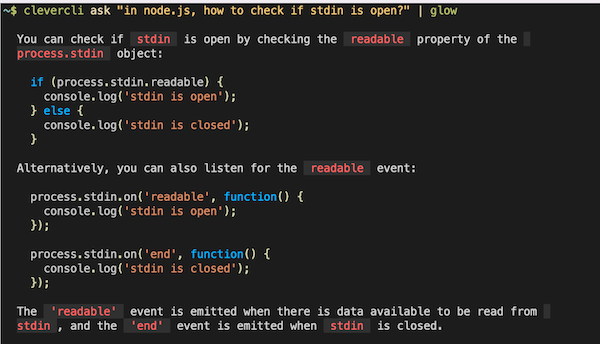

# clevercli


clevercli is a CLI that queries OpenAI models (e.g. ChatGPT). New prompt types can easily be added and there is a growing list of community maintained prompts.

Requires `export OPENAI_API_KEY="<your OpenAI api key>"` (e.g. in your `~/.bashrc`).

```console
$ npm install -g @clevercli/cli
```

## Usage

```console
$ clevercli <prompt_type> <prompt_input>
```

Or using `stdin`:

```console
$ echo "<prompt_input>" | clevercli <prompt_type>
```

## Example

```console
$ clevercli joke "banana"
Why did the banana go to the doctor? Because it wasn't peeling well!
```

```console
$ echo "what is stdin?" | clevercli eli5
```

Tip: since many answers use markdown, you can pipe to [glow](https://github.com/charmbracelet/glow) to get a nicer rendering:

```console
$ clevercli ask "in node.js, how to check if stdin is open?" | glow
```



## Built-in prompts

- **ask**: Just passes through the input directly to ChatGPT.

Example: `clevercli ask "in node.js, how to check if stdin is open?"`

- **eli5**: Explain Me Like I'm 5.

Example: `clevercli eli5 "why is the sky blue?"`

- **joke**: Tells a joke about the topic.

Example: `clevercli joke "yo mamma"`

- **refactor**: Asks ChatGPT to refactor code in a file.

Example: `clevercli refactor < index.ts`

See [./src/prompts/](./src/prompts) for the list of available prompts.

## Adding a prompt

Create a file `~/.clevercli/<prompt name>.mjs` which returns an object that follows the `PromptConfiguration` interface.

```typescript
export interface PromptConfiguration {
  createPrompt(input: string): string;
  parseResponse?(response: string, input: string): ParsedResponse;
  model?: string;
}
```

For example:

```javascript
// eli5.mjs
export default {
  createPrompt(input) {
    return `Provide a very detailed explanation but like I am 5 years old (ELI5) on this topic: ${input}.\n###\n`;
  },
};
```

## Adding a builtin prompt

1. Fork the repository.

2. Create a new prompt configuration in [./src/prompts/](./src/prompts/). You can use the [eli5](./src/prompts/eli5.ts) prompt configuration as a base.

3. Send a pull request!

Here's a sample prompt configuration:

```typescript
import { ParsedResponse, PromptConfiguration } from "../types.js";

const promptConfiguration: PromptConfiguration = {
  createPrompt(input: string) {
    return `Provide a very detailed explanation but like I am 5 years old (ELI5) on this topic: ${input}.\n###\n`;
  },
  parseResponse(response: string): ParsedResponse {
    return { message: response };
  },
};

export default promptConfiguration;
```

## Cache

Query results are cached on your filesystem's cache directory.

## Debugging

```
DEBUG="clevercli:*" clevercli eli5 "friendship"
```

## TODO

- [x] Streaming API.
- [ ] GH workflow + tests
- [ ] Support older Node.js versions?
- [ ] Interactively prompt OpenAI API key and save to filesystem (when OPENAPI_KEY is not set)
